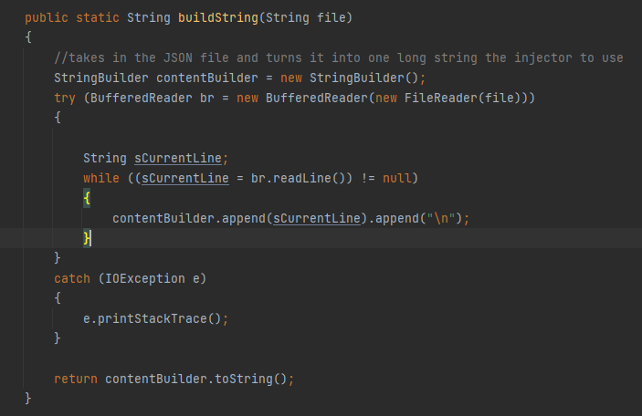
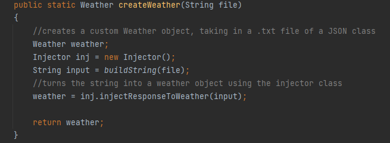

# Table of Contents
- [Management of The Project](#management-of-the-project)
  - [Agile](#agile)
    - [Sprint](#sprint)
  - [User Stories](#user-stories)
  - [Roles](#roles)
  - [Tracking Tool - Trello](#tracking-tool-trello)
- [How Framework Works](#how-framework-works)
  - [How Open Weather Api Behaves](#how-open-weather-api-behaves)
- [Connection Manager](#connection-manager)
- [Injector](#injector)
- [Data Transfer Object](#data-transfer-object)
- [Manual Testing](#manual-testing)
- [Behavior-driven Development approach](#behavior-driven-development-approach)
- [Junit Testing](#junit-testing)
Within the JUNIT testing file, you can see the Connection Manager Test
This testing covers all parts of the classes created to make sure they are working correctly
- [Mocking](#mocking)
Within the JUNIT folder you will see a Mocking file and a mockSetUp File. 
Within the mocking file you can see examples of the mocking that you can use. 
To make things easier we have the mockSetUp class. This takes in one example of 
the responses that the API gives that then changes it into a weather
object and then can use the program in the same way that you would if you connect to the program without
having to connect to it.
You can see the below code for how the string is built. It takes in an example file, and changes
it all into one long string, that a weather object can then be created.
- 
- 
- [Advantages of The Framework](#advantages-of-this-framework)