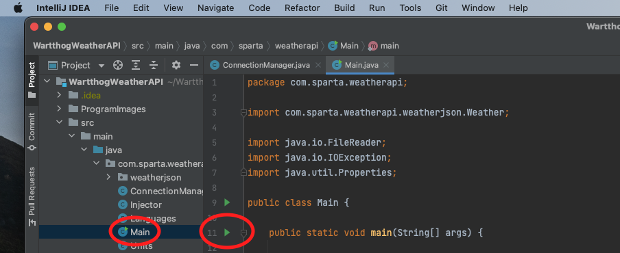

# Warthog's-Weather-API


> Contributors:
>
> • Roberto Lovece - Junior Java SDET Consultant | [Portfolio](https://robertolovece.github.io/Portfolio-Website/) | [GitHub](https://github.com/RobertoLovece) | [LinkedIn](https://www.linkedin.com/in/roberto-lovece-20abb121a/) |
>
> • Suyash Srivastava - Junior Java SDET Consultant | [GitHub](https://github.com/SuyashsGit) | [LinkedIn](https://www.linkedin.com/in/suyash-srivastava-0a977a15a/) |
>
> • Mehmet Yetim - Junior Java SDET Consultant | [GitHub](https://github.com/mehmetyetim) | [LinkedIn](https://www.linkedin.com/in/mehmet-akif-yetim-65a4081b6/) |
>
> • Aiden Sykes - Junior Java SDET Consultant | [GitHub](https://github.com/AidenSykes1999) | [LinkedIn](https://www.linkedin.com/in/aiden-sykes/) |
>
> • Stephen Jones - Junior Java SDET Consultant | [GitHub](https://github.com/StephenJones1997) | [LinkedIn](https://www.linkedin.com) |
>
> • Donovan Cupueran - Junior Java SDET Consultant | [GitHub](https://github.com/djucacupueran) | [LinkedIn](https://www.linkedin.com/in/donovan-juca-01b7aa222/) |
>
>

## **Table Of Contents**
* [**Overview**](#overview)
* [**What is framework?**](#what-is-framework)
* [**Project Planning (Agile - Scrum)**](#project-planning)
    - [Sprint 1](#sprint-1)
    - [Sprint 2](#sprint-2)
    - [Sprint 3](#sprint-3)
    - [Mood Board](#mood-board)
    - [User Stories](#user-stories)
* [**Software and Dependencies**](#software-and-dependencies)
    - [IntelliJ](#intellij)
    - [JDK](#jdk)
    - [Apache Maven](#apache-maven)
    - [JUnit Jupiter API](#junit-jupiter-api)
    - [Jackson](#jackson)
    - [Hamcrest](#hamcrest)
* [**How to use the project**](#how-to-use-the-project)
    - [How to download](#how-to-download)
    - [Instructions for using the project on the console](#instructions-for-using-the-project-on-the-console)
* [**Testing**](#testing)
    - [JUnit Testing](#junit-testing)
    - [Manual Testing](#manual-testing)
    - [Mocking](#mocking)
    - [Behavior-driven Development Tests](#behavior-driven-development-tests)
* [**Future work**](#future-work)

### **Overview**

In this project, we have built a testing framework to test the Open Weather Map API.
Our framework will only be focused on the [Current Weather](https://openweathermap.org/current) section.

<br/>
<div align="left">
    <b><a href="#table-of-contents">↥ Back to top</a></b>
</div>
<br/>

### **What is framework?**

A framework, or software framework, is a platform that provides a foundation for developing software applications. They’re used in many industries, including web development, data science, and more.

<br/>
<div align="left">
    <b><a href="#table-of-contents">↥ Back to top</a></b>
</div>
<br/>

### **Project Planning**

In this project, Agile methodology was implemented. As a framework of Agile, we worked under Scrum framework. Trello was used for the management of the project. Daily stand-up, Spring planning, Retrospective meetings were hold. There were 3 sprints throughout the project. We had 3 user stories in this project.

<br/>
<div align="left">
    <b><a href="#table-of-contents">↥ Back to top</a></b>
</div>
<br/>

#### **Sprint 1**

Development and testing started at the same time. Connection manager, injector and data transfer object classes were added to the project.


<br/>
<div align="left">
    <b><a href="#table-of-contents">↥ Back to top</a></b>
</div>
<br/>

#### **Sprint 2**

Development and testing sides were updated. Languages and Units classes as enum were added to the framework. More BDD testing was done and JUnit tests were developed more with Mockito dependency.


<br/>
<div align="left">
    <b><a href="#table-of-contents">↥ Back to top</a></b>
</div>
<br/>

#### **Sprint 3**

At third sprint, the part of the project that mainly focused was presentation. Group members prepared and practice their parts and the presentation itself took about 15 minutes with the questions asked at the end of the presentation.

<br/>
<div align="left">
    <b><a href="#table-of-contents">↥ Back to top</a></b>
</div>
<br/>

#### **Mood Board**

Moods of group members were put into the mood board at retrospective meetings in each sprint. This graph is as below: 


<br/>
<div align="left">
    <b><a href="#table-of-contents">↥ Back to top</a></b>
</div>
<br/>

#### **User Stories**

There were 3 user stories, and they were listed as below: 

_User Story 1_

As a user, I want to the response to be formatted into an object and return different parts of the object.

_Acceptance Criteria:_
- The Json object is converted into a weather object.
- Each variable has a getter to retrieve the information.

_User Story 2_

As a user, I want a class that takes all the information from the response and creates a DTO.

_Acceptance Criteria:_
- Injector takes in an Json Object.
- Injector splits out the parts and constructs a new class.

_User Story 3_

As a user, I want to be able to connect to API in dynamic way so that I can easily connect to other URLs.

_Acceptance Criteria:_
- Hide all codes to do with HTTP.
- Read the URL from a properties file.
- Generate a method with different parameters to pass.

<br/>
<div align="left">
    <b><a href="#table-of-contents">↥ Back to top</a></b>
</div>
<br/>

### **Software and dependencies**
#### **IntelliJ**
IntelliJ IDEA is an integrated development environment written in Java for developing computer software. It is developed by JetBrains, and is available as an Apache 2 Licensed community edition, and in a proprietary commercial edition. Both can be used for commercial development.
- In this application we have used IntelliJ IDEA [Version 2021.3.2](https://www.jetbrains.com/idea/download/#section=windows)

#### **JDK**
The JDK is the Java Development Kit, the full-featured SDK for Java. It has everything the JRE has, but also the compiler (javac) and tools (like javadoc and jdb). It is capable of creating and compiling programs.
- In this application we have used JDK [Version 17.0.2](https://jdk.java.net/17/)
#### **Apache Maven**
Apache Maven is a software project management and comprehension tool. Based on the concept of a project object model (POM), Maven can manage a project's build, reporting and documentation from a central piece of information.
* _**Note:** This dependency can be imported using IntelliJ._
* _Go to **"File" > "New Project"** and then selecting **"Maven"** as the project structure._
#### **JUnit Jupiter API**

JUnit Jupiter is the API for writing tests using JUnit version 5. JUnit 5 is the project name (and version) that includes the separation of concerns reflected in all three major modules: JUnit Jupiter, JUnit Platform, and JUnit Vintage.
- In this application we have used JUnit Jupiter [Version 5.8.2](https://mvnrepository.com/artifact/org.junit.jupiter/junit-jupiter-api/5.8.2)
* _**Note:** This dependency can be imported within Intellij using Apache Maven and IntelliJ's built-in dependency generator._
* Alternatively you can open the Maven **"pom.xml"** file and paste in the following code within the **"dependencies"** section of the file:
```xml
    <dependency>
        <groupId>org.junit.jupiter</groupId>
        <artifactId>junit-jupiter</artifactId>
        <version>5.8.2</version>
    </dependency>
```

#### **Jackson**
Jackson is a Java Json library used for parsing and generating Json files. It has built in Object Mapper class which parses json files and deserializes it to custom java objects. It helps in generating json from java objects.

- In this application we have used Jackson [Version 2.13.1](https://javadoc.io/doc/com.fasterxml.jackson.core/jackson-databind/latest/index.html)
* _**Note:** This dependency can be imported within Intellij using Apache Maven and IntelliJ's built-in dependency generator._
* Alternatively you can open the Maven **"pom.xml"** file and paste in the following code within the **"dependencies"** section of the file:
```xml
    <dependency>
        <groupId>com.fasterxml.jackson.core</groupId>
        <artifactId>jackson-databind</artifactId>
        <version>2.13.1</version>
    </dependency>
```

#### **Hamcrest**
Hamcrest is a framework that assists writing software tests in the Java programming language. It supports creating customized assertion matchers ('Hamcrest' is an anagram of 'matchers'), allowing match rules to be defined declaratively. These matchers have uses in unit testing frameworks such as JUnit and jMock.


<br/>
<div align="left">
    <b><a href="#table-of-contents">↥ Back to top</a></b>
</div>
<br/>

### **How to use the project**

#### **How to download**
- Step 1: Click on the green 'Code' button and then choose the 'Download ZIP' option.
  
- Step 2: Extract the file by double-clicking on the downloaded ZIP file.
  
- Step 3: Open IntelliJ IDEA application, then click on File option (the option is in the top left corner of the screen) and then click on Open. Then navigate to the place where you have extracted the folder, select the folder and click 'Open'.
  
  
- Step 4: Click on 'Trust Project' button, and then Click on 'New Window'.
  
  
- Step 5: Look for Main.java class after following these steps: WartthogWeatherAPI > src > main > java > com.sparta.weatherapi > Main.java
  
- Step 6: Run the Main class and enjoy the project.

#### **Instructions for using the project on the console**

The only thing that needs to be done is calling the Connection Manager class and use its methods to be able to send HTTP request. This will be converted to DTO classes by using Injector. We can test our values afterwards. In gherkin, you can use the methods that were created already before. 


  <br/>
<div align="left">
    <b><a href="#table-of-contents">↥ Back to top</a></b>
</div>
<br/>

### **Testing**

#### **Junit Testing**
Within the JUNIT testing file, you can see the Connection Manager Test
This testing covers all parts of the classes created to make sure they are working correctly

<br/>
<div align="left">
    <b><a href="#table-of-contents">↥ Back to top</a></b>
</div>
<br/>

#### **Mocking**
Within the JUNIT folder you will see a Mocking file and a mockSetUp File. 
Within the mocking file you can see examples of the mocking that you can use. 
To make things easier we have the mockSetUp class. This takes in one example of 
the responses that the API gives that then changes it into a weather
object and then can use the program in the same way that you would if you connect to the program without
having to connect to it.
You can see the below code for how the string is built. It takes in an example file, and changes
it all into one long string, that a weather object can then be created.


<br/>
<div align="left">
    <b><a href="#table-of-contents">↥ Back to top</a></b>
</div>
<br/>

#### **Manual Testing**

As a tool, Postman was used to test the Open Weather API manually. It gives us more opportunity to understand how this API works and responds back after going through the documentation itself.


<br/>
<div align="left">
    <b><a href="#table-of-contents">↥ Back to top</a></b>
</div>
<br/>

#### **Behavior-driven Development Tests**

Gherkin language with Given, When, Then clauses were used to make tests more understandable for the people who are not technical. We aimed to use common methods as much as possible to be able to create more tests without paying more efforts. These tests created by Gherkin language were implemented into the methods using Cucumber dependency.


<br/>
<div align="left">
    <b><a href="#table-of-contents">↥ Back to top</a></b>
</div>
<br/>

### **Future Work**
Possible improvements for Warthog's Weather API 2.0:
- Allow the framework to work on different modes (xml and html)
- Making the framework to support other endpoints from the [OpenWeather Map API](https://openweathermap.org).

<br/>
<div align="left">
    <b><a href="#table-of-contents">↥ Back to top</a></b>
</div>
<br/>
=============================== ENJOY THE PROJECT ===============================
